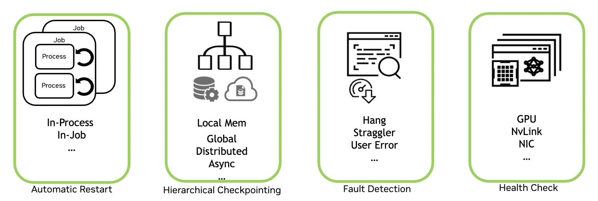

nvidia-resiliency-ext v0.3.0
=============================

**nvidia-resiliency-ext** is a set of tools developed by NVIDIA to improve large-scale distributed training resiliency.

Features
--------

- `Hang detection and automatic in-job restarting <https://gitlab-master.nvidia.com/dl/osiris/nvidia_resiliency_ext/-/tree/anjshah/doc_updates/docs/source/fault_tolerance?ref_type=heads>`_
- `In-process restarting <https://gitlab-master.nvidia.com/dl/osiris/nvidia_resiliency_ext/-/tree/anjshah/doc_updates/docs/source/inprocess?ref_type=heads>`_
- `Async checkpointing <https://gitlab-master.nvidia.com/dl/osiris/nvidia_resiliency_ext/-/tree/anjshah/doc_updates/docs/source/checkpointing/async?ref_type=heads>`_
- `Local checkpointing <https://gitlab-master.nvidia.com/dl/osiris/nvidia_resiliency_ext/-/tree/anjshah/doc_updates/docs/source/checkpointing/local?ref_type=heads>`_
- `Straggler (slower ranks) detection <https://gitlab-master.nvidia.com/dl/osiris/nvidia_resiliency_ext/-/tree/anjshah/doc_updates/docs/source/straggler_det?ref_type=heads>`_

.. toctree::
   :maxdepth: 3
   :caption: Documentation contents:

   fault_tolerance/index
   inprocess/index
   checkpointing/async/index
   checkpointing/local/index
   straggler_det/index
